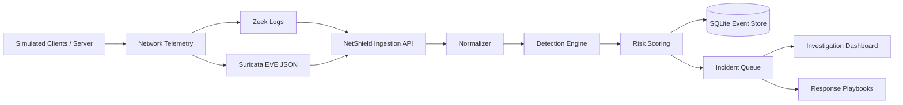

# NetShield SOC — Enterprise Network Detection & Response Lab

A portfolio-grade cybersecurity + network security project that simulates a small enterprise SOC. It ingests Zeek/Suricata-style network telemetry, normalizes events, applies detection rules mapped to MITRE ATT&CK, calculates risk, and presents incidents through a FastAPI web dashboard.

> Career note: this demonstrates hands-on project capability and should be presented as a personal lab, not fabricated professional employment experience.

## What this demonstrates

- Network security monitoring and telemetry analysis
- Zeek and Suricata / EVE JSON concepts
- SIEM-style event normalization and alerting
- MITRE ATT&CK technique mapping
- Detection engineering with YAML rules
- Risk scoring and incident prioritization
- IOC-oriented investigation workflow
- Python / FastAPI REST APIs
- SQLite persistence, unit tests, Docker
- SOC automation and incident-response playbooks
- Microsoft Sentinel/KQL and Splunk/SPL detection translations

## Architecture



## Quick start

### Python

```bash
cd netshield-soc
python3 -m venv .venv
source .venv/bin/activate
pip install -r requirements.txt
python scripts/run_demo.py
uvicorn app.main:app --reload
```

Open `http://127.0.0.1:8000`.

### Docker

```bash
docker compose up --build
```

## Demo detections

- **SSH brute force** — repeated SSH authentication attempts
- **Port scan** — one source probing many destination ports
- **DNS tunneling indicator** — high-volume, unusually long DNS queries
- **Web attack indicator** — SQL injection/path traversal/script patterns

The bundled events are synthetic and safe to run locally.

## API

- `GET /api/health`
- `GET /api/events`
- `GET /api/alerts`
- `GET /api/incidents`
- `GET /api/metrics`
- `POST /api/demo/load`
- `POST /api/ingest/zeek`
- `POST /api/ingest/suricata`
- `POST /api/incidents/{id}/status`

## Interview narrative

**Telemetry → Normalization → Detection → MITRE mapping → Risk → Triage → Response → Reporting**

Be ready to discuss threshold tuning, false positives, time windows, correlation, network segmentation, least privilege, and production migration to Microsoft Sentinel, Splunk, or OpenSearch.

## Resume entry

**NetShield SOC — Enterprise Network Detection & Response Lab** | Python, FastAPI, Zeek, Suricata, MITRE ATT&CK, Docker, SQL, YAML

- Built an end-to-end SOC monitoring platform that normalized Zeek/Suricata-style telemetry, stored security events in SQL, and exposed REST APIs for investigation and incident management.
- Engineered detections for SSH brute force, network service scanning, DNS tunneling indicators, and web-attack patterns; mapped alerts to MITRE ATT&CK and prioritized incidents with risk-based severity scoring.
- Developed repeatable attack simulations, detection unit tests, analyst workflow documentation, and a browser dashboard for alert triage and incident status tracking.

## Project files

See `docs/architecture.md`, `docs/detection-engineering.md`, `docs/incident-response.md`, `docs/sentinel-kql.md`, `docs/splunk.md`, and `docs/resume-and-interview.md` for recruiter/interview material.